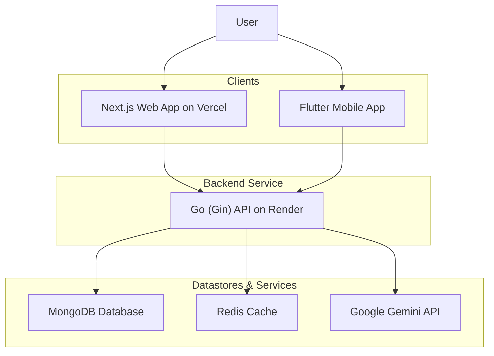

# EthioGuide Platform 🇪🇹

  

 

EthioGuide is a revolutionary digital platform designed to simplify and demystify the complex world of Ethiopian bureaucracy. By combining AI-powered guidance with a community-driven knowledge hub, we empower individuals and businesses to navigate government procedures efficiently and confidently.

---

### ⚠️ **Understanding This Repository's Structure**

This repository serves as the central hub for the EthioGuide project. The `main` branch contains this documentation. The source code for each part of the platform is located in its own branch within this repository, which mirrors its own dedicated development repository.

| Service       | Branch in this Repo                                          | Dedicated Repository                                     |
|---------------|--------------------------------------------------------------|----------------------------------------------------------|
| **Backend API** | [`backend-main`](https://github.com/RealEskalate/G6-EthioGuide/tree/backend-main)       | [ethio-guide-backend](https://github.com/Ethio-Guide/ethio-guide-backend)       |
| **Frontend Web**  | [`frontend-main`](https://github.com/RealEskalate/G6-EthioGuide/tree/frontend-main)      | [ethio-guide-frontend](https://github.com/Ethio-Guide/ethio-guide-frontend)     |
| **Mobile App**    | [`mobile-main`](https://github.com/RealEskalate/G6-EthioGuide/tree/mobile-main)        | [ethio-guide-mobile](https://github.com/Ethio-Guide/ethio-guide-mobile)         |

**For all development, issues, and pull requests, please use the dedicated repositories.**

---

## 🔗 Live Environments

*   **Live Web App (Vercel):** [**ethio-guide.vercel.app**](https://ethio-guide.vercel.app/)
*   **Live API Endpoint (Render):** [**https://ethio-guide-backend.onrender.com/api/v1**](https://ethio-guide-backend.onrender.com/api/v1)
*   **API Documentation (Swagger):** [**View the Live API Docs**](https://ethio-guide-backend.onrender.com/swagger/index.html)

---

## The Problem

Ethiopia’s bureaucratic landscape is a labyrinth of fragmented, outdated information. Citizens and foreigners waste countless hours and money navigating disorganized government websites and unreliable brokers. This lack of transparency fosters confusion, inefficiency, and distrust.

## The Solution

EthioGuide tackles this problem head-on by providing a centralized, reliable, and user-friendly platform. We combine cutting-edge technology with community wisdom to create a single source of truth for Ethiopian procedures.

## 🏛️ System Architecture

The EthioGuide platform is built on a modern, decoupled architecture to ensure scalability and maintainability.

## ✨ Core Features

*   **🤖 AI-Powered Guidance:** An intelligent assistant, powered by Google Gemini with RAG, provides instant, step-by-step guidance for bureaucratic procedures.
*   **👥 Community Discussions:** A forum for users to ask questions and share tips, creating a living, self-correcting knowledge base.
*   **✅ Personalized Checklists:** Users can track their progress on procedures with personal checklists, helping them stay organized.
*   **🌐 Seamless Localization:** Full support for both English and Amharic, with AI-powered chat translation for many more local languages.
*   **🔐 Secure Authentication:** Robust user authentication with JSON Web Tokens (JWT) and secure refresh token rotation.
*   **⚡ High Performance:** Optimized API performance with MongoDB indexing and Redis caching for a fast and responsive user experience.
*   **🔍 Universal Search:** A powerful search engine to quickly find procedures, organizations, and relevant discussions.

## 🛠️ Tech Stack

This project is built with a modern and scalable tech stack, chosen for performance and developer experience.

| Component      | Technologies                                                                   |
| -------------- | ------------------------------------------------------------------------------ |
| **Frontend**   | [**Next.js**](https://nextjs.org/), [React](https://reactjs.org/), [TypeScript](https://www.typescriptlang.org/) |
| **Backend**    | [**Go (Golang)**](https://go.dev/), [Gin](https://gin-gonic.com/)                |
| **Mobile**     | [**Flutter**](https://flutter.dev/), [Dart](https://dart.dev/)                  |
| **Database**   | [**MongoDB**](https://www.mongodb.com/) (NoSQL Database)                         |
| **Caching**    | [**Redis**](https://redis.io/)                                                 |
| **AI**         | [**Google Gemini API**](https://ai.google.dev/)                                |
| **Deployment** | [**Vercel**](https://vercel.com/) (Frontend), [**Render**](https://render.com/) (Backend & DB), [**Docker**](https://www.docker.com/) |

## 📧 Contact

Project Link: [https://github.com/Ethio-Guide](https://github.com/Ethio-Guide)

---
